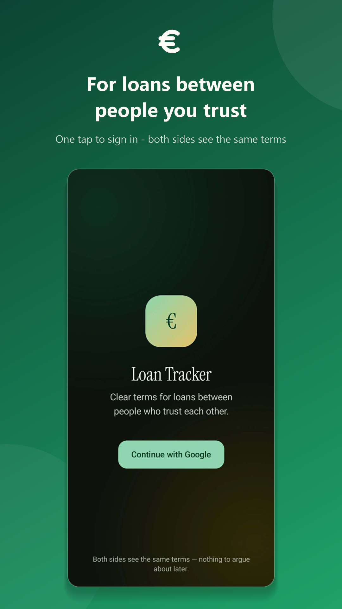
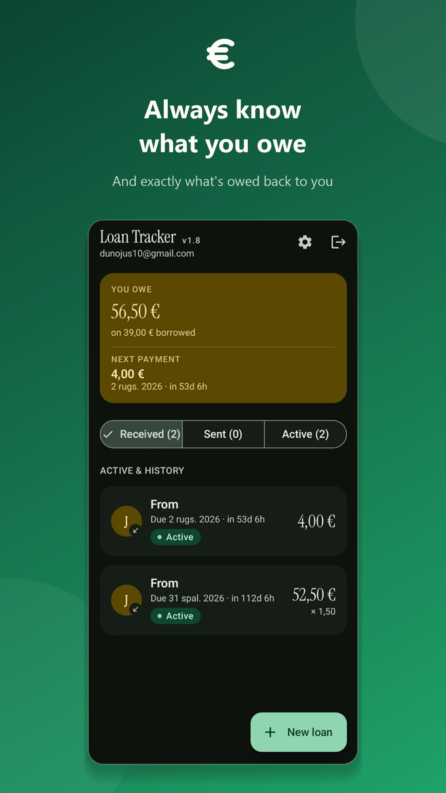
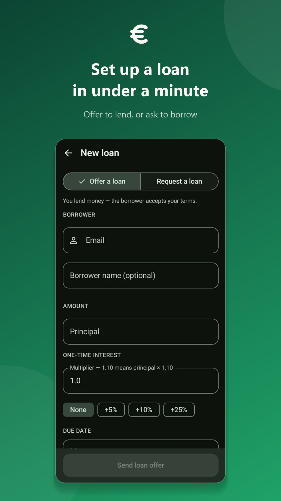

# Loan Tracker

An Android app for lending money to friends and family with clear terms. One
person offers a loan (or asks for one) by e-mail address. The other accepts it,
and from then on both see the same amount, interest, due date and repayment plan.
Repayments are reported by the borrower and confirmed by the lender, and both
sides get notifications and reminders.

**[⬇ Download the APK](https://github.com/nojsar/LoanTracker/releases/latest)**
&nbsp;·&nbsp; Android 11+ &nbsp;·&nbsp; sign in with any Google account (no test account needed)

| Sign in | Home | New loan |
| :---: | :---: | :---: |
|  |  |  |

## Technologies

Kotlin, Jetpack Compose (Material 3), ViewModel + StateFlow, coroutines,
Firebase Authentication (Google sign-in via Credential Manager), Cloud Firestore
(real-time sync), WorkManager (payment reminders), GitHub Actions (automatic
Google Play uploads).

## How I used AI

I built the app with [Claude Code](https://claude.com/claude-code) as a pair
programmer. I decided what to build, split it into small steps, tested every
build on my own phone, and chose what to keep. The AI wrote and refactored code
and explained unfamiliar Android APIs. It also helped debug a Play release where
Google sign-in was broken: we found a missing SHA-1 fingerprint and added a
Gradle check so that mistake now fails the build instead of reaching users.
Commits the AI co-wrote are marked with a `Co-Authored-By: Claude` trailer.

## Installing

Download the APK from [Releases](https://github.com/nojsar/LoanTracker/releases/latest),
open it, and allow "Install unknown apps" when Android asks. If you already have
the Google Play version, uninstall it first, because the two builds are signed
with different keys.
